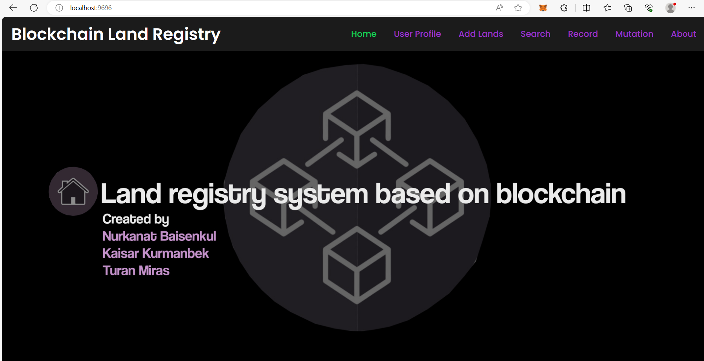

# Contributors
* [Nurkanat Baysenkul](https://github.com/tuchaVshortah)
* [Kaysar Kurmanbek](https://github.com/mazga2003)
* [Miras Turan](https://github.com/TMiras)

# Project description:
Our project, Blockchain Land Registry, is a platform that leverages blockchain technology to create a land registry system that is secure, transparent, and immutable. Unlike the traditional land registry system, which is prone to inefficiencies, errors, and fraud, our system ensures trust and accuracy using decentralized ledger technology. Our system is built on Ethereum, Solidity, and IPFS, which make it efficient, scalable, and cost-effective. Our system enables anyone, anywhere in the world, to access the land registry records and verify their ownership without intermediaries. Our project is currently under development.

## Tech Stack Used:

**Frontend:**
* Javascript
* HTML
* CSS
* Metamask Chrome Extension

**Backend:**
* Ethereum Blockchain (Truffle Suite)
* Solidity
* Ganache

**Important Tools/Libraries:**
* VS-Code
* NodeJS (npm)
* Web3JS

# Installation instructions:
Step-by-step instructions on how to install and set up your project.

## VS Code:
Visual Studio Code (VS Code) is a popular open-source code editor developed by Microsoft. It provides a wide range of features and extensions that make it easy for developers to write code, debug applications, and collaborate with others. VS Code is available for Windows, macOS, and Linux operating systems.

**To install VS Code on your computer, follow these steps:**

1. Go to the official website of VS Code at [https://code.visualstudio.com/](https://code.visualstudio.com/).
2. Click on the "Download" button for your operating system (Windows, macOS, or Linux).
3. Once the download is complete, run the installer file. The installer will guide you through the installation process.
4. You can choose the default settings or customize the installation as per your requirement.
5. Once the installation is complete, launch VS Code from the Start menu or the desktop shortcut.

Now that you have VS Code installed, you can use it to write code in a wide range of programming languages, including JavaScript, Python, C++, and more.

## NodeJS:
Node.js is a popular open-source, cross-platform, back-end JavaScript runtime environment that enables developers to build server-side applications with JavaScript. It uses an event-driven, non-blocking I/O model that makes it lightweight and efficient, allowing it to handle large-scale, real-time applications.

**To install Node.js on your computer, follow these steps:**

1. Go to the official website of Node.js at [https://nodejs.org/en/](https://nodejs.org/en/).
2. Click on the "Download" button for the LTS (Long-Term Support) version, which is recommended for most users.
3. Choose the installer package for your operating system (Windows, macOS, or Linux).
4. Run the installer file and follow the instructions to complete the installation process. You can choose the default settings or customize the installation as per your requirement.
5. Once the installation is complete, open your command prompt or terminal and type node -v to check if Node.js is installed correctly. It should display the version number if it's installed.

Now that you have Node.js installed, you can use it to build server-side applications, create command-line tools, and run JavaScript scripts on your computer. Some of the popular use cases of Node.js include building web applications with frameworks like Express.js, creating real-time applications with Socket.IO, and automating tasks with Node.js scripts.

## Web3JS:
Web3.js is a JavaScript library that enables developers to interact with the Ethereum blockchain and build decentralized applications (DApps). It provides a simple and convenient way to connect to the Ethereum network, send transactions, and interact with smart contracts. Web3.js is widely used in the Ethereum development community and is supported by most Ethereum clients and frameworks.

**To install Web3.js on your project, you can use a package manager like npm or yarn. Here's how to install Web3.js using npm:**

1. Open your command prompt or terminal and navigate to your project directory.
2. Type 'npm install web3' and press Enter. This will install the latest version of Web3.js and its dependencies in your project.
3. Once the installation is complete, you can import Web3.js into your project using the require statement.

Web3.js can also be used to send transactions, interact with smart contracts, and listen for events on the Ethereum network. It provides a wide range of methods and features that make it easy to build robust and reliable DApps on Ethereum.

## Ganache:
Ganache is a personal blockchain for Ethereum development that enables developers to test and deploy smart contracts locally. It provides a simple and convenient way to test and debug Ethereum applications without needing to connect to the main Ethereum network. Ganache provides a graphical user interface (GUI) and a command-line interface (CLI) that developers can use to interact with the blockchain and simulate different network conditions.

**To install Ganache on your computer, follow these steps:**

1. Go to the official website of Ganache at [https://www.trufflesuite.com/ganache](https://www.trufflesuite.com/ganache).
2. Click on the "Download" button to download the installer package for your operating system (Windows, macOS, or Linux).
3. Run the installer file and follow the instructions to complete the installation process. You can choose the default settings or customize the installation as per your requirement.
4. Once the installation is complete, launch Ganache from the Start menu or the desktop shortcut.

Now that you have Ganache installed, you can use it to test and deploy Ethereum applications locally. Some of the popular use cases of Ganache include testing smart contracts, interacting with the blockchain using the GUI or CLI, and simulating different network conditions to see how your application behaves under different scenarios. Ganache also integrates with popular development tools like Truffle, Remix, and MetaMask, making it easy to develop, test, and deploy Ethereum applications.

# Steps to run Project:
Instructions on how to use this project, including any command-line arguments or configuration options.
1. Clone the github repository and cd to the folder
2. Install the Web3JS using npm [https://web3js.readthedocs.io/en/v1.10.0/getting-started.html](https://web3js.readthedocs.io/en/v1.10.0/getting-started.html)
3. Open Ganache and keep it running in the Background
4. Install the Metamask chrome extension, choose the local network (Ganache) and import the accounts
5. Go to web Remix ide [https://remix.ethereum.org](https://remix.ethereum.org) Create Registry.sol file in contracts folder and compile the Registry contract Copy the ABI of contract
6. After deploy the contract with **Injected Provider-Mestamask** when transaction will be confirm then copy the contract address
7. Copy contract address and ABI as seen in the image below and paste in variable Address and ABI located in the file ./LandChain/src/index.js
    ```  
	const Address="0x2fF0.......";
	const ABI=[.....] ;
  	window.web3 = await new Web3(window.ethereum);
  	window.contract = await new window.web3.eth.Contract( ABI, Address);
    ```
8. Open new terminal and Start the server : **node server.js**
9. Now go to [http://localhost:9696](http://localhost:9696)

## Smart-Contract Code (Registry.sol):
 ```
 // SPDX-License-Identifier: MIT
pragma solidity >= 0.5.0 < 0.9.0;

// Creating a Smart Contract
contract Registry {

  struct users {
    address Account;
    string name;
    string gender;
    string Address;
    string phone;
    string password;
  }

  struct asset {
    address Account;
    string Location;
    string District;
    string plot_no;
    string area;
    int asset_value;
  }

  mapping(string => address[]) Khatiyan;
  address[] temp;
  users[] usr;
  mapping(string => asset[]) all_asts;
  asset[] ast;

//   address  put this in account input datatype    

  function add_user(address Account, string memory name, string memory gender, string memory Address, string memory phone, string memory password) public {
    users memory e = users(Account, name, gender, Address, phone, password);
    usr.push(e);
  }


  function get_user(address Account) public view returns(string memory, string memory, string memory, string memory, string memory) {
    uint i;
    for (i = 0; i < usr.length; i++) {
      users memory e = usr[i];
      if (e.Account == Account) {
        return (e.name, e.gender, e.Address, e.phone, e.password);
      }
    }
    return ("Not Found", "Not Found", "Not Found", "Not Found", "");
  }


//   -----------------------Asset wala kaam ------------------------------------

  function add_asset(address Account, string memory Location, string memory District, string memory plot_no, string memory area, int value) public {
    asset memory a = asset(Account, Location, District, plot_no, area, value);
    ast.push(a);
  }

  function change_assetValue(address account, int value) public{
    uint i;
    for (i = 0; i < ast.length; i++) {
      asset memory a = ast[i];
      if (a.Account == account) {
        ast[i].asset_value = value;
      }
    }
  }
  function get_asset(address Account) public view returns(string memory, string memory, string memory, string memory, int) {
    uint i;
    for (i = 0; i < ast.length; i++) {
      asset memory a = ast[i];
      if (a.Account == Account) {
        return (a.Location, a.District, a.plot_no, a.area, a.asset_value);
      }
    }
    return ("Not Found", "Not Found", "Not Found", "Not Found", 0);
  }


//   -----------------------Asset transfer wala kaam ------------------------------------

  function get_array() public view returns( asset[] memory){
      return(ast);
  }
  
  function transferlnd(address payable sellerAddress, uint values) payable public {
    uint pay=msg.value + values;
    sellerAddress.transfer(pay);
    uint i;
    for (i = 0; i < ast.length; i++) {
      asset memory a = ast[i];
      if (a.Account == sellerAddress) {
        ast[i].Account=msg.sender;
      }
    }
  }
}
```

# Contribution guidelines:
Information on how others can contribute to your project, including how to submit bug reports, feature requests, and pull requests.

# Appendix of LandChain:
First of all run the Ganache-GUI after run the **node server.js** then go to chrome browser [http://localhost:9696](http://localhost:9696) after that you can see our system. In Fig.\ref{fig:home}, The specific steps for creating a user profile, registering land assets, putting land for sale, and changing land ownership in a blockchain-based land registry system will depend on the particular design of the system. However, here are some general steps that could be involved in these processes:

[](larger_image_path_or_external_link)

## User Profile Page:
* Go to the website or application for the blockchain-based land registry system. 
* Click on the "Create Profile" button and fill in the required information, including your name, address, and contact details.
* Create a login ID and password to access the system in the future then Submit the registration form and assets details.
    
[](larger_image_path_or_external_link)
[](larger_image_path_or_external_link)

## Add Lands Page:
* Go to ``Record'' menu of the LandChain system.
* Click on the "Register Land Asset" button then fill the required information, including the land's location, and size, as well as any relevant documentation or images.
* Submit the registration form and pay any registration fees that may be required.

[](larger_image_path_or_external_link)

## Search Page:
* Go to ``Search'' menu of the LandChain system and fill the required data then click on "Search" button.
* Now you can see the user details with assets details.

[](larger_image_path_or_external_link)

## Record Page:
* Go to ``Record'' menu of the LandChain system and click on given button.
* Now here, you can see the lists of users with attached assets details.

[](larger_image_path_or_external_link)

## Mutation Page:
* Buyer verify yourself then buyer send the request to seller by seller id.
* Seller verify yourself then get the request from buyer.
* Now seller able to transfer ownership of assets with buyer.
* Submit the transfer form and wait for confirmation of the transfer.

[](larger_image_path_or_external_link)


# Contact information:
Information on how to contact you, such as your email address or social media handles.

# FAQ:
Frequently asked questions about your project and its use.
